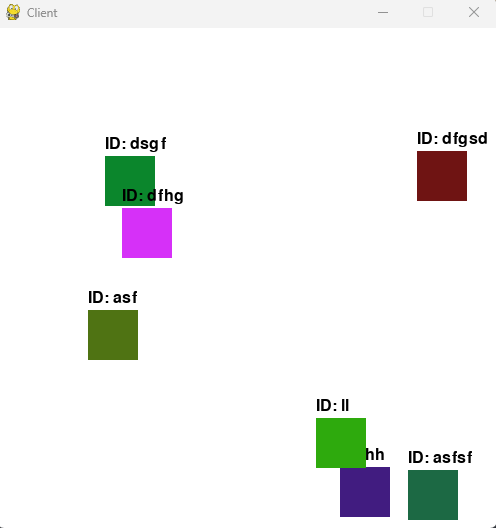

# Multiplayer Game Template with Asyncio


This multiplayer game template demonstrates how to build a scalable server using Python's asyncio library to handle a significant number of connections. The template includes a simple Player class as a demonstration.

multi_p/

├── client/

│   ├── __init__.py

│   ├── client.py

│   
├── server/

│   ├── __init__.py

│   ├── connectionManager.py

│   └── player.py

│
├── __init__.py

└── network.py
│ 
## Features
* Asynchronous server using Python's asyncio library
* Connection manager to handle and manage multiple connections
* Scalable server design to accommodate a decent number of connections
* Basic player class for demonstration purposes

## Getting Started
Prerequisites
Python 3.7 or later
## Installation
Clone the repository:
Copy code
```bash
git clone https://github.com/...
```
Change to the repository directory:

Install any required dependencies:

Copy code
```bash
pip install -r requirements.txt
```

Running the Server
Run the server using the following command:
```bash
python server.py
```

The server will start and listen for connections on the default IP and port.

Running the Client
Run the client using the following command:
```bash
python client.py
```

The client will connect to the server and start receiving updates from other connected players.

## Usage
You can use this template as a starting point for your own multiplayer game. Modify the Player class to include your game-specific logic, and update the client and server scripts to handle your custom game data.

Feel free to extend the connection manager and server to handle more complex game logic, such as rooms or matchmaking, and to optimize performance further.

License
This project is licensed under the MIT License. See the LICENSE file for more information.